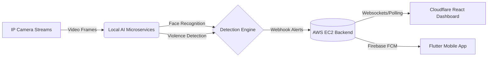

# SafetyWatch System 🛡️👁️

**An advanced, AI-powered workplace safety and surveillance system.** 

SafetyWatch connects IP camera streams to deep learning models to detect violence and identify employees in real-time. Whenever an incident occurs, the system instantly alerts administrators through a live web dashboard and pushes mobile notifications to security personnel.

---

## 🏗️ System Architecture Pipeline



SafetyWatch is designed with a distributed architecture:
- **AI Models:** Run completely **locally** to ensure minimal latency, data privacy, and efficient processing of high-bandwidth video streams.
- **Backend API:** Hosted on an **AWS EC2** instance, acting as the central nervous system to store alerts, dispatch push notifications, and serve data to the clients.
- **Web Dashboard:** Hosted on **Cloudflare Pages** for lightning-fast global access.

---

## ✨ Key Features & AI Models

### 🔴 Real-Time Violence Detection
Detects altercations or physical violence in CCTV feeds in real-time.
- **Architecture:** Hybrid CNN-RNN combining **VGG16**, **Bidirectional ConvLSTM2D**, and **LSTM**.
- **Attention Mechanism:** Implements **CBAM** (Convolutional Block Attention Module) to focus on the most discriminative spatial regions and feature channels.
- **Intelligent Motion Cropping:** An optical-flow-based algorithm detects the 5-second window with the highest motion intensity to crop the action.
- **Performance:** 88.83% Accuracy and 94.97% ROC-AUC. Trained using Categorical Focal Loss on the unified VDD Dataset (UBI-FIGHTS, SCVD, and RWF-2000).

### 👤 Employee Facial Recognition
Automated identification of employees in the camera's field of view.
- **Face Detection:** Leverages **MTCNN** (Multi-task Cascaded Convolutional Networks) for robust bounding box detection and face alignment.
- **Feature Extraction:** Uses **InceptionResnetV1** (pretrained on `vggface2` via `facenet_pytorch`) to generate highly distinct 512-dimensional facial embeddings.
- **Matching:** Calculates Cosine Similarity between live embeddings and the registered database, utilizing dynamic visual thresholds (Green/Yellow/Red) based on confidence scores.

### 💻 Admin Web Dashboard (React + Vite)
A sleek, responsive application hosted on Cloudflare Pages for adding new cameras, managing employee records, and monitoring live AI alerts as they happen.

### 📱 Mobile Companion App (Flutter)
A fully-featured Flutter application for Android and iOS, providing on-the-go access to camera feeds and delivering instant **Push Notifications** when violence is detected using Firebase Cloud Messaging (FCM).

---

## 🛠️ Technology Stack

| Domain | Technologies Used |
| :--- | :--- |
| **AI & Vision** | Python, PyTorch, OpenCV, `facenet_pytorch`, MTCNN |
| **Backend API** | PHP, Laravel 10, SQLite / MySQL, Composer, AWS EC2 |
| **Web Frontend** | React.js, Vite, Axios, Cloudflare Pages |
| **Mobile App** | Flutter, Dart, Firebase Cloud Messaging (FCM) |

---

## 📁 Repository Structure

```text
SafetyWatch_System/
├── ai/                 # Python AI scripts and microservice endpoints
│   ├── face_recognition/     # MTCNN + InceptionResnetV1 service
│   └── violence_detection/   # VGG16 + CBAM model APIs
├── backend/            # Laravel REST API, Auth, and Webhooks
├── frontend/           # React.js Web Dashboard source
└── mobile_app/         # Flutter Mobile Application
```

---

## 🚀 Getting Started

Follow these steps to set up the system.

### 1. Backend Server (Laravel on AWS/Local)
Navigate to the `backend` folder to set up the API.
```bash
cd backend
composer install
cp .env.example .env
php artisan key:generate
php artisan migrate
php artisan serve
```
*Note: Ensure `firebase-credentials.json` is placed in `storage/app/` to enable mobile push notifications.*

### 2. Web Dashboard (React)
Navigate to the `frontend` folder. (For production, this is deployed to Cloudflare Pages).
```bash
cd frontend
npm install
npm run dev
```

### 3. Mobile App (Flutter)
Navigate to the `mobile_app` folder.
```bash
cd mobile_app
flutter clean
flutter pub get
flutter run
```
*Note: Ensure `google-services.json` is placed in `android/app/` to enable Firebase on Android devices.*

### 4. Local AI Microservices
The AI models must be run locally on a machine with a capable GPU.
Navigate to the respective AI folders and install the Python dependencies:
```bash
# Example for Violence Detection
cd ai/violence_detection
python -m venv venv
venv\Scripts\activate
pip install -r requirements.txt
python demo_app.py
```

---

## 🎓 Graduation Project

This project was developed as a comprehensive graduation project for academic purposes.

### SafetyWatch Team
- **Ahmed Arafa** (Me)
- **Mahmoud Abdelaal**
- **Monica Basem**
- **Mohamed Bahaa**
- **Karim Tarek**
- **Ahmed Kamal**
- **Ahmed Hossam**
