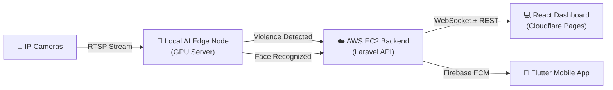

<p align="center">
  
</p>

<h1 align="center">SafetyWatch</h1>

<p align="center">
  <strong>Turning passive cameras into proactive, AI-powered security systems.</strong>
</p>

<p align="center">
  
  
  
  
  
  
</p>

---

## 📌 What is SafetyWatch?

SafetyWatch is a full-stack AI surveillance platform that transforms ordinary CCTV cameras into intelligent security agents. It **detects violence in real-time**, **recognizes employees automatically**, and **sends instant push notifications** to security teams — all within seconds.

> Traditional cameras just **record** incidents. SafetyWatch **prevents** them.

---

## 🏗️ System Architecture



The system is built on a **distributed architecture** optimized for speed and privacy:

| Layer | Where It Runs | Why |
|:------|:-------------|:----|
| **AI Models** | Locally on a GPU machine | Zero latency, full data privacy, no cloud dependency |
| **Backend API** | AWS EC2 (Ubuntu) | Central hub for alerts, auth, employee data, and push notifications |
| **Web Dashboard** | Cloudflare Pages | Lightning-fast global access for admins |
| **Mobile App** | Android / iOS | On-the-go monitoring with instant push alerts |

---

## 🔥 Core Features

### 🔴 Real-Time Violence Detection

Detects physical altercations in CCTV feeds and sends instant alerts.

| Component | Details |
|:----------|:--------|
| **Architecture** | Hybrid CNN-RNN: `VGG16` → `Bidirectional ConvLSTM2D` → `LSTM` |
| **Attention** | CBAM (Convolutional Block Attention Module) — focuses on fight regions, ignores background |
| **Smart Cropping** | Optical-flow algorithm auto-crops the 5-second window with highest motion intensity |
| **Accuracy** | **88.83%** Accuracy · **94.97%** ROC-AUC |
| **Dataset** | VDD (UBI-FIGHTS + SCVD + RWF-2000) |
| **Loss Function** | Categorical Focal Loss (handles class imbalance) |

### 👤 Employee Facial Recognition

Automated attendance tracking — employees are identified the moment they walk past a camera.

| Component | Details |
|:----------|:--------|
| **Face Detection** | MTCNN (Multi-task Cascaded Convolutional Networks) |
| **Feature Extraction** | InceptionResnetV1 (pretrained on VGGFace2 via `facenet_pytorch`) |
| **Matching** | Cosine Similarity with dynamic confidence thresholds (Green / Yellow / Red) |
| **Embedding Size** | 512-dimensional facial embeddings |

### 💻 Admin Web Dashboard

A sleek, responsive React + Vite application deployed on Cloudflare Pages.

- Manage employees (add, edit, delete, upload face photos)
- Add and configure IP cameras
- Monitor live AI alerts and incident logs in real-time
- View attendance records with filtering and export

### 📱 Mobile Companion App

A fully-featured Flutter app for Android & iOS.

- Receive **instant push notifications** when violence is detected (Firebase FCM)
- View live alerts and incident history on-the-go
- Manage employee data from anywhere
- Robust token management for 100% reliable notification delivery

---

## 🛠️ Tech Stack

| Domain | Technologies |
|:-------|:-------------|
| **AI & Computer Vision** | Python · TensorFlow · PyTorch · OpenCV · MTCNN · facenet_pytorch · FastAPI · Scikit-learn |
| **Backend API** | PHP · Laravel 10 · SQLite · Sanctum Auth · Firebase Admin SDK (kreait) |
| **Web Frontend** | React.js · Vite · React Router · Axios · Cloudflare Pages |
| **Mobile App** | Flutter · Dart · Firebase Cloud Messaging · Provider |
| **Infrastructure** | AWS EC2 · Docker · Nginx · Cloudflare DNS |
| **AI Deployment** | Docker Compose · NVIDIA GPU · CUDA · Edge Computing |

---

## 📁 Project Structure

```
SafetyWatch-System/
│
├── ai/                              # AI Microservices (runs locally on GPU)
│   ├── face_recognition/            # MTCNN + InceptionResnetV1 service
│   │   ├── api.py                   # FastAPI endpoints for face operations
│   │   ├── edge_client.py           # Edge node client for camera polling
│   │   └── src/                     # Core face recognition logic
│   ├── violence_detection/          # VGG16 + CBAM violence detection
│   │   ├── api.py                   # FastAPI endpoints for violence analysis
│   │   ├── edge_worker.py           # Edge orchestrator (camera polling + detection)
│   │   ├── models/                  # Model architecture (CBAM, losses)
│   │   └── configs/                 # Model configuration
│   └── docker-compose.yml.example   # Template for Docker deployment
│
├── backend/                         # Laravel 10 REST API (deployed on AWS EC2)
│   ├── app/Http/Controllers/        # API controllers (Auth, Employee, Camera, AI)
│   ├── routes/api.php               # API route definitions
│   ├── database/migrations/         # Database schema
│   └── Dockerfile                   # Production Docker build
│
├── frontend/                        # React + Vite Dashboard (Cloudflare Pages)
│   ├── src/                         # React components, pages, and services
│   └── public/                      # Static assets
│
├── mobile_app/                      # Flutter Mobile App (Android & iOS)
│   ├── lib/                         # Dart source code
│   └── android/                     # Android-specific configuration
│
└── deployment_scripts/              # Server setup & deployment automation
```

---

## 🚀 Getting Started

### Prerequisites

- **PHP 8.1+** & Composer
- **Node.js 18+** & npm
- **Flutter 3.x** & Dart
- **Python 3.10+** with CUDA-capable GPU
- **Docker** (optional, for containerized AI deployment)

### 1. Backend (Laravel API)

```bash
cd backend
composer install
cp .env.example .env
php artisan key:generate
php artisan migrate --seed
php artisan serve
```

> **Note:** Place `firebase-credentials.json` in `storage/app/` to enable push notifications.

### 2. Web Dashboard (React)

```bash
cd frontend
npm install
cp .env.example .env.local    # Configure your API URL
npm run dev
```

### 3. Mobile App (Flutter)

```bash
cd mobile_app
flutter clean
flutter pub get
flutter run
```

> **Note:** Place `google-services.json` in `android/app/` for Firebase on Android.

### 4. AI Microservices (GPU Required)

```bash
cd ai
cp docker-compose.yml.example docker-compose.yml
# Edit docker-compose.yml with your API token and server URL
docker-compose up --build
```

Or run without Docker:
```bash
cd ai/violence_detection
pip install -r requirements.txt
python edge_worker.py
```

---

## ⚙️ Environment Variables

| File | Location | Purpose |
|:-----|:---------|:--------|
| `backend/.env` | `backend/` | Laravel app key, DB config, Sanctum domains, Firebase |
| `frontend/.env.local` | `frontend/` | API URL for development |
| `ai/docker-compose.yml` | `ai/` | API tokens, server URL, camera keys |

All sensitive files are **gitignored**. Copy the `.example` templates and fill in your own credentials.

---

## 🎓 Graduation Project

This project was developed as a comprehensive graduation project for the Faculty of Computer Science.

### SafetyWatch Team
- **Ahmed Arafa**
- **Mahmoud Abdelaal**
- **Monica Basem**
- **Mohamed Bahaa**
- **Karim Tarek**
- **Ahmed Kamal**
- **Manar Alaa**
- **Ahmed Hossam**

### Project Supervisors
We would like to extend our special thanks to our supervisors for their invaluable guidance throughout this project:
- **Dr. Samar Hesham**
- **Eng. Sara Hamdy**
