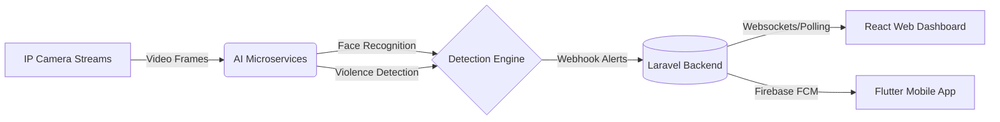

# SafetyWatch System 🛡️👁️

**An advanced, AI-powered workplace safety and surveillance system.** 

SafetyWatch connects IP camera streams to deep learning models to detect violence and identify employees in real-time. Whenever an incident occurs, the system instantly alerts administrators through a live web dashboard and pushes mobile notifications to security personnel.

---

## 🏗️ System Architecture Pipeline



## ✨ Key Features

- **🔴 Real-Time Violence Detection:** A custom PyTorch model utilizing CBAM (Convolutional Block Attention Module) architecture hosted on RunPod to instantly identify altercations or physical violence in camera feeds.
- **👤 Employee Facial Recognition:** Automated identification of employees in the camera's field of view using InsightFace and OpenCV, linking real-time appearances to the employee database.
- **💻 Admin Web Dashboard:** A sleek, responsive React.js application for adding new cameras, managing employee records, and monitoring live AI alerts as they happen.
- **📱 Mobile Companion App:** A fully-featured Flutter mobile application for Android and iOS, providing on-the-go access to camera feeds and delivering instant **Push Notifications** when violence is detected.
- **☁️ Cloud & Edge Ready:** Designed with a modular microservice architecture allowing the AI, Backend, and Frontends to be deployed independently (e.g., AWS, Oracle Cloud, or edge servers).

---

## 🛠️ Technology Stack

| Domain | Technologies Used |
| :--- | :--- |
| **AI & Vision** | Python, PyTorch, OpenCV, InsightFace, Docker, RunPod |
| **Backend API** | PHP, Laravel 10, SQLite / MySQL, Composer, AWS EC2 |
| **Web Frontend** | React.js, Vite, Axios |
| **Mobile App** | Flutter, Dart, Firebase Cloud Messaging (FCM) |

---

## 📁 Repository Structure

```text
SafetyWatch_System/
├── ai/                 # Python AI models, APIs, and Docker configurations
│   ├── face_recognition/     # InsightFace employee recognition
│   └── violence_detection/   # PyTorch CBAM violence classification
├── backend/            # Laravel REST API, Auth, and Database Migrations
├── frontend/           # React.js Web Dashboard
└── mobile_app/         # Flutter Mobile Application
```

---

## 🚀 Getting Started (Local Development)

Follow these steps to spin up the entire system locally for testing and demonstration.

### 1. Backend (Laravel)
```bash
cd backend
composer install
cp .env.example .env
php artisan key:generate
php artisan migrate
php artisan serve
```
*Note: Make sure to place your `firebase-credentials.json` in `storage/app/` to enable push notifications.*

### 2. Frontend (React)
```bash
cd frontend
npm install
npm run dev
```

### 3. Mobile App (Flutter)
```bash
cd mobile_app
flutter pub get
# Connect an Android/iOS device or emulator
flutter run
```
*Note: Make sure to place your `google-services.json` in `android/app/` to enable Firebase on Android.*

### 4. AI Microservices (Optional/RunPod)
If running locally instead of the cloud:
```bash
cd ai
docker-compose up --build
```

---

*Developed for the final project presentation.*
